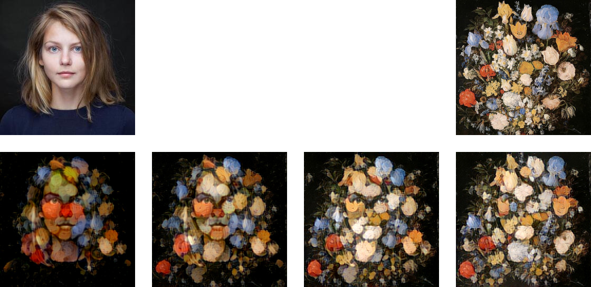
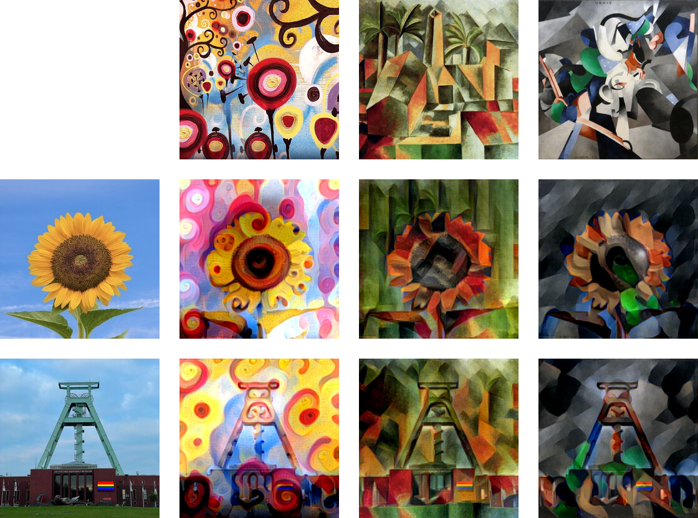
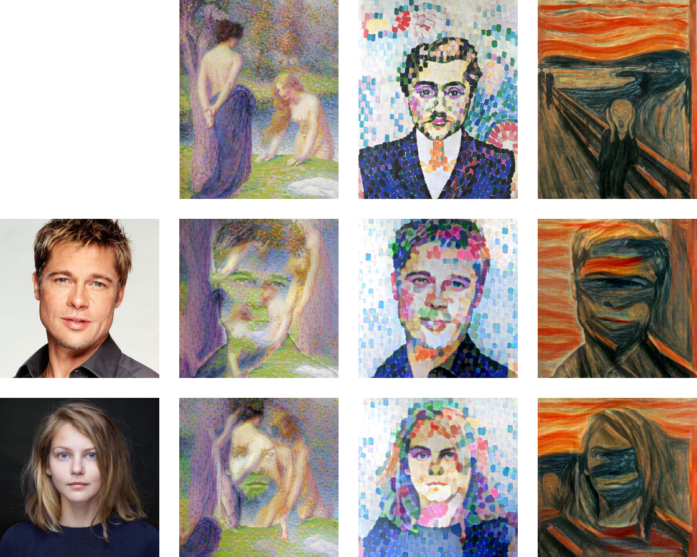

Style Transfer by Optimal Transport (Kolkin et al, 2019)
========================================================
In this repository I aim to give a brief description and demonstration of the
approach to neural style transfer described by Kolkin, Salavon, and
Shakhnarovich in their 2019 article _Style Transfer by Relaxed Optimal
Transport and Self-Similarity_.

The implementation I use here is part of my python package
[`nstesia`](https://github.com/mdehling/nstesia/) and can be found in its
module [`kolkin_2019`](
https://github.com/mdehling/nstesia/blob/main/src/nstesia/kolkin_2019.py).

> [!NOTE]
> There are two simple ways to run the demo notebook yourself without installing
> any software on your local machine:
>
> 1. View the notebook on GitHub and click the _Open in Colab_ button (requires
>    a Google account).
> 2. Create a GitHub Codespace for this repository and run the notebook in
>    VSCode (requires a GitHub account & access to the Codespaces GPU Beta).

Method
------
Kolkin's approach to neural style transfer is optimization based:  Given a
content image $x_c$ and a style image $x_s$, an initial pastiche image $x_p$
is chosen and iteratively modified to minimize a total loss function

$$
\mathcal{L}(x_c, x_s, x_p) = \frac{
  \alpha\cdot l_c + l_m + l_r + \alpha^{-1}\cdot l_p
}{2+\alpha+\alpha^{-1}} \quad,
$$

where the parameter $\alpha$ denotes the content weight, and the loss terms
$l_c$, $l_m$, $l_r$, and $l_p$ are defined below.

Denote by $\varphi$ a function representing a VGG16 feature extraction network
pre-trained on the ImageNet dataset for object recognition.  The function
takes an image tensor $x$ of shape `[H,W,3]` as input and produces a feature
tensor $\varphi(x)$ of shape `[H,W,C]` as output.  This feature tensor
consists of the feature responses for a subset of layers of the VGG16 network,
linearly upsampled to the spatial dimensions of the image and concatenated
along the channels axis.  Below, I will use a bar over a tensor to denote its
flattened version, e.g., I will write $\bar{x}_c$ for the content image viewed
as a tensor of shape `[H*W,3]`, and I will use the shorthand notation
$\varphi_c = \varphi(x_c)$.

Let $V$ be a vector space with a distance function $d$ (not necessarily a
metric).  The _relaxed earth movers distance_ between tensors
$A \in V^{\otimes N}$ and $B \in V^{\otimes M}$ is defined as

$$
\mathop{\text{REMD}}(A, B) = \max\Bigg(
  \frac{1}{N} \sum_i \min_j d(A_i, B_j),
  \frac{1}{M} \sum_j \min_i d(A_i, B_j)
\Bigg) \quad.
$$

The _REMD loss_ $l_r$ is the relaxed earth movers distance

$$ l_r(x_s,x_p) = \mathop{\text{REMD}}(\bar\varphi_s, \bar\varphi_p) $$

between the style and pastiche feature tensors with respect to the cosine
distance $d_\text{cos}(v, w) = 1 - v \cdot w / (\|v\|\cdot\|w\|)$.

The _color matching loss_ $l_p$ is also defined in terms of the relaxed earth
movers distance

$$ l_p(x_s,x_p) = \mathop{\text{REMD}}(\bar x_s, \bar x_p) \quad, $$

this time for the style and pastiche image tensors and with respect to the
euclidian distance $d_\text{eucl}(v, w) = \|v - w\|_2$.

The _moment matching loss_ $l_m$ is defined as

$$
l_m(x_s,x_p) =
  \frac{1}{C} \Big\|\mu(\bar\varphi_s) - \mu(\bar\varphi_p)\Big\|_1 +
  \frac{1}{C^2} \Big\|\Sigma(\bar\varphi_s) - \Sigma(\bar\varphi_p)\Big\|_1
  \quad,
$$

where, for a feature tensor $\bar\varphi$ of shape `[N,C]`, $\mu(\bar\varphi)$
denotes the spatial average of shape `[C]` and $\Sigma(\bar\varphi)$ denotes
the covariance matrix of shape `[C,C]`.

Finally, the _content loss_ $l_c$ is given by

$$
l_c(x_c,x_p) = \frac{1}{N^2} \sum_{i,j} \Bigg|
  \frac{D^c_{ij}}{\sum_i D^c_{ij}} -
  \frac{D^p_{ij}}{\sum_i D^p_{ij}}
\Bigg| \quad,
$$

where $D$ denotes the cosine distance matrix with entries
$D_{ij} = d_\text{cos}(\bar\varphi_i, \bar\varphi_j)$.

Results
-------
To try Kolkin's optimal transport based approach to neural stylization, have a
look at the notebook [`style-transport.ipynb`](style-transport.ipynb).  The
images below were produced using it.

> **Note**
> The images included here are lower quality jpeg files.  I have linked them
> to their lossless png versions.

This first image shows a range of stylization for various different values of
the content weight parameter.  Kolkin implemented guided transfer, something
I plan to add to my implementation in the future.  With it, one could
significantly improve these stylizations.

The following are two sets of stylizations of the same content images in the
same styles as used to demonstrate various other style transfer methods.  See,
e.g., my repositories
[`johnson-fast-style-transfer`](
https://github.com/mdehling/johnson-fast-style-transfer),
[`dumoulin-multi-style-transfer`](
https://github.com/mdehling/dumoulin-multi-style-transfer), and
[`ghiasi-arbitrary-style-transfer`](
https://github.com/mdehling/ghiasi-arbitrary-style-transfer).

Note that Kolkin's approach to neural stylization seems to transfer style
image patches.  The method works very well for some content/style combinations
while requiring careful parameter tuning for others.  E.g., in the first style
below (Petitjean's _femmes au bain_) a lower content weight or lower learning
rate should significantly improve the stylization.

References
----------
* Kolkin, Salavon, Shakhnarovich - _Style Transfer by Relaxed Optimal
  Transport and Self-Similarity_, 2019.
  [[pdf]](https://openaccess.thecvf.com/content_CVPR_2019/papers/Kolkin_Style_Transfer_by_Relaxed_Optimal_Transport_and_Self-Similarity_CVPR_2019_paper.pdf)
  [[suppl]](https://openaccess.thecvf.com/content_CVPR_2019/supplemental/Kolkin_Style_Transfer_by_CVPR_2019_supplemental.pdf)
  [[code]](https://github.com/nkolkin13/STROTSS)
* David Futschik - A reimplementation of STROTSS.
  [[code]](https://github.com/futscdav/strotss)
* Gatys, Ecker, Bethge - _A Neural Algorithm of Artistic Style_, 2015.
  [[pdf]](https://openaccess.thecvf.com/content_cvpr_2016/papers/Gatys_Image_Style_Transfer_CVPR_2016_paper.pdf)
